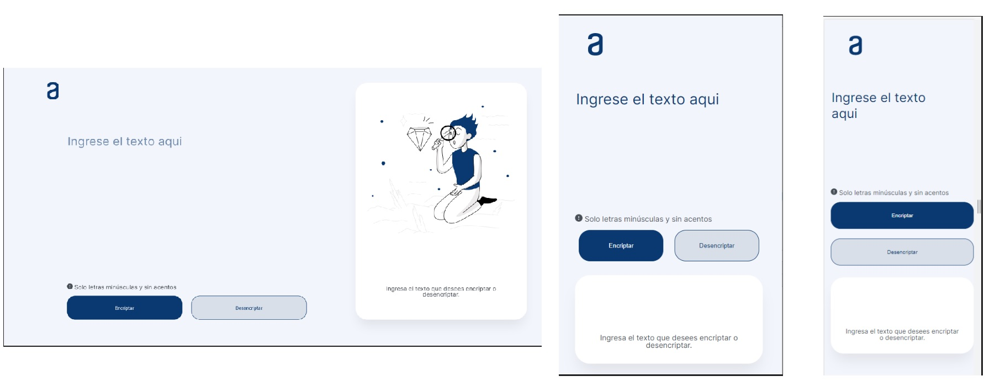

  <h2>Challenge ONE | Lógica de Programación | Encriptador de texto</h2>
 
### El reto

Los usuarios deben ser capaces de:

- Ver el diseño óptimo según el tamaño de pantalla de su dispositivo
- Ver estados de desplazamiento para elementos interactivos
- El Reto consiste en crear una página web que pueda cifrar y descifrar un texto introducido por el usuario y mostrar dicho texto en forma cifrada o descifrada.

## ✔️ Requisitos del desafío

- _Debe funcionar solo con letras minúsculas._
- _No deben ser utilizados letras con acentos ni caracteres especiales._
- _Debe ser posible convertir una palabra para la versión encriptada también devolver una palabra encriptada para su versión original._

```
Por ejemplo:
"gato" => "gaitober"
gaitober" => "gato"
```

- _La página debe tener campos para inserción del texto que será encriptado o desencriptado,
  y el usuario debe poder escoger entre as dos opciones._
- _El resultado debe ser mostrado en la pantalla._

### Extras:

- _Un botón que copie el texto encriptado/desencriptado para la sección de transferencia, o sea que tenga la misma funcionalidad del ctrl+co de la opción "copiar" del menú de las aplicaciones._

## 🔑 Llaves de encriptación

Las llaves de encriptación solicitadas son las siguientes:

- **La letra "a" es convertida a "ai".**
- **La letra "e" es convertida a "enter".**
- **La letra "i" es convertida a "imes".**
- **La letra "o" es convertida a "ober".**
- **La letra "u" es convertida a "ufat".**

### Captura de pantalla

<div align='center'>

</div>

### Links

<a href="https://brayanlegarda1.github.io/Encriptador-de-texto/" target="_blank">Ver Demo</a>

### Reconocimiento

- El desafío fue proporcionado por [Oracle + Alura Latam "ONE - Oracle Next Education"](https://www.aluracursos.com/challenges/challenge-one-logica/sprint01-construye-un-encriptador-texto-con-javascript")

### Constriudo con

- Marcado HTML5 semántico
- Propiedades personalizadas de CSS
- Flexbox
- Grid
- Javascript
